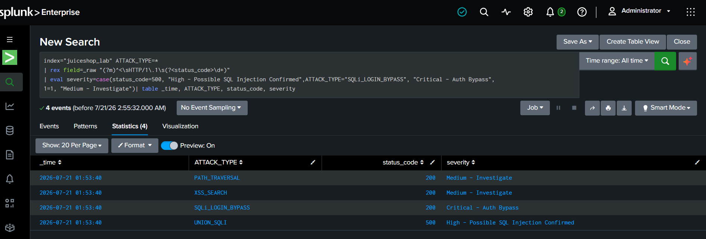

# SOC Detection Lab: OWASP Juice Shop + Splunk

A hands-on Blue Team / SOC Tier 1 lab simulating the detection, triage, and alerting workflow for common web application attacks (SQL Injection, XSS, Path Traversal) using **Splunk Enterprise** as the SIEM.

This project was built to demonstrate practical SOC Analyst skills: generating attack traffic, ingesting logs into a SIEM, writing detection searches (SPL), classifying severity, and configuring automated alerts.

>โปรเจกต์นี้จำลองการทำงานของ SOC Tier 1 Analyst ตั้งแต่ต้นจนจบ — เริ่มจากยิง attack จำลอง (SQL Injection, XSS, Path Traversal) ใส่เว็บแอปช่องโหว่ OWASP Juice Shop จากนั้นนำ log เข้า Splunk (SIEM) เพื่อตรวจจับ วิเคราะห์ระดับความรุนแรง (severity) และตั้ง Alert อัตโนมัติ เพื่อฝึกทักษะที่ตรงกับงานสาย SOC/Blue Team จริง เช่น log analysis, threat detection, และ incident triage

---

## Overview

- **Target application:** OWASP Juice Shop (intentionally vulnerable web app, run via Docker)
- **Attacker:** Kali Linux VM
- **SIEM:** Splunk Enterprise (Free/Trial license)
- **Goal:** Simulate a mini SOC workflow — generate attacks, capture evidence, detect them in Splunk, classify severity, and set up an alert

## Architecture

```
[Kali VM - Attacker]  --curl payloads-->  [Juice Shop - Docker Target, 192.168.229.133:3000]
        |
        v
  attack_traffic.log (curl -v output, timestamped)
        |
        v (shared folder transfer)
  [Splunk Enterprise - Windows host]
        |
        v
  Search (SPL) --> Severity Classification --> Alert
```

## Tools Used

| Tool | Purpose |
|---|---|
| Kali Linux (VM) | Attacker machine, traffic generation |
| OWASP Juice Shop (Docker) | Intentionally vulnerable target application |
| Splunk Enterprise | SIEM — log ingestion, search, alerting |
| curl | Payload delivery + verbose request/response logging |

## Methodology

1. **Generate attack traffic** — sent 4 distinct attack payloads from Kali to Juice Shop using `curl -v`, capturing full request/response detail with timestamps into a single log file (`attack_traffic.log`).
2. **Transfer log** — moved the log file to the Windows host running Splunk via a VMware shared folder (`/mnt/hgfs/ShareHTB/`).
3. **Ingest into Splunk** — uploaded the log as a new source type (`juiceshop_lab`) into a dedicated index (`juiceshop_lab`), verifying event breaking (4 distinct events parsed correctly).
4. **Detect & classify** — wrote SPL searches to extract `ATTACK_TYPE` and HTTP `status_code`, then built a severity classification (`eval case()`) to simulate SOC triage logic.
5. **Alert** — saved the detection search as a scheduled Splunk Alert (`Number of Results > 0`) to simulate automated, ongoing monitoring.

## Attack Traffic Generated

| Attack Type | Payload | HTTP Status | Result |
|---|---|---|---|
| SQLi Login Bypass | `' OR 1=1--` in login email field | 200 | **Confirmed** — returned valid admin JWT token (auth bypass) |
| XSS (Reflected) | `<script>alert(1)</script>` in search query | 200 | Request accepted; requires browser-based verification to confirm execution |
| Path Traversal | `../../../etc/passwd` | 200 | Not exploitable — served static app file, not the OS file (false positive, documented for realism) |
| SQL Injection (UNION) | `' UNION SELECT 1,2,3--` in search query | **500** | **Confirmed** — triggered `SQLITE_ERROR: near "UNION"` revealing unsanitized input & backend DB type |

## Key Findings

> **สรุปผลการทดสอบ:** พบช่องโหว่ SQL Injection ระดับ Critical ที่ทำให้ bypass การ login เข้าเป็น admin ได้จริง และ SQL Injection แบบ UNION ที่ยืนยันได้จาก error message ของฐานข้อมูล ส่วน XSS ตรวจพบว่า request ผ่านเข้าไปได้แต่ยังต้องยืนยันผลกระทบเพิ่มเติมผ่าน browser และ Path Traversal ถูกจัดเป็น false positive หลังตรวจสอบแล้วว่าไม่สามารถเข้าถึงไฟล์ระบบจริงได้

- **Critical:** SQLi login bypass succeeded, granting an authenticated admin session token without valid credentials.
- **High:** UNION-based SQL injection returned a database error, confirming unsanitized input and disclosing backend technology (SQLite).
- **Medium:** XSS payload was accepted by the server; full impact requires client-side (browser) confirmation.
- **False positive:** Path traversal payload did not access OS files — Express served its own static file instead. Documented to show accurate triage, not just "everything is critical."

## Detection in Splunk

All 4 events were successfully ingested into a dedicated index (`juiceshop_lab`) and correctly parsed as separate events. See [`spl-queries.md`](spl-queries.md) for the full search queries used, including the severity classification logic:

```spl
index="juiceshop_lab" ATTACK_TYPE=*
| rex field=_raw "(?m)^<\sHTTP/1\.1\s(?<status_code>\d+)"
| eval severity=case(
    status_code=500, "High - Possible SQL Injection Confirmed",
    ATTACK_TYPE="SQLi_LOGIN_BYPASS", "Critical - Auth Bypass",
    1=1, "Medium - Investigate"
  )
| table _time, ATTACK_TYPE, status_code, severity
```

Result:

| Time | Attack Type | Status Code | Severity |
|---|---|---|---|
| 2026-07-21 01:53:40 | SQLi_LOGIN_BYPASS | 200 | Critical - Auth Bypass |
| 2026-07-21 01:53:40 | UNION_SQLI | 500 | High - Possible SQL Injection Confirmed |
| 2026-07-21 01:53:40 | XSS_SEARCH | 200 | Medium - Investigate |
| 2026-07-21 01:53:40 | PATH_TRAVERSAL | 200 | Medium - Investigate |

## Alerting

A scheduled Splunk Alert (`Juice Shop Attack Detection Alert`) was configured to trigger when the detection search returns results, simulating a real-time SOC monitoring rule.

- **Trigger condition:** Number of Results > 0
- **Schedule:** Cron (recurring)
- **Action:** Add to Triggered Alerts

## Incident Response Process

See [`ir-playbook.md`](ir-playbook.md) for the full Detection → Triage → Escalation → Remediation → Lessons Learned workflow, based on the findings above.

## Screenshots

| # | File | Description |
|---|---|---|
| 01 | `01-kali-attack-terminal.png` | Kali terminal — attack payloads sent via curl |
| 02 | `02-shared-folder-transfer.png` | Log file transferred to Splunk host via shared folder |
| 03 | `03-splunk-source-type-eventbreak.png` | Splunk "Set Source Type" — event breaking / advanced settings |
| 04 | `04-splunk-source-type-preview.png` | Splunk Set Source Type — event preview, 4 events parsed correctly |
| 05 | `05-search-attacktype-statuscode.png` | Search results — ATTACK_TYPE + status_code table |
| 06 | `06-search-severity-classification.png` | Search results — severity classification |
| 07 | `07-alert-configuration.png` | Alert configuration detail |
| 08 | `08-alerts-list.png` | Alerts list — active scheduled alert |

*(See `/screenshots` folder)*



## Lessons Learned

- Application debug logs (`docker logs`) are often insufficient for detection — they lack full request payload/query string detail. Capturing traffic at the point of origin (`curl -v`) produced far more usable evidence than relying on the container's default logging.
- Not every "attack" attempt is actually exploitable — the path traversal test was a false positive and is documented as such rather than overstated, reflecting real SOC triage discipline.
- Next steps: integrate a proper reverse proxy / web server access log (e.g., Nginx in front of Juice Shop) for more realistic HTTP logging, and explore Splunk's Common Information Model (CIM) for standardized field mapping.

## Disclaimer

All testing was performed exclusively against a local, intentionally vulnerable lab application (OWASP Juice Shop) running in an isolated Docker container. No external or third-party systems were targeted. This project is for educational and portfolio purposes only.
