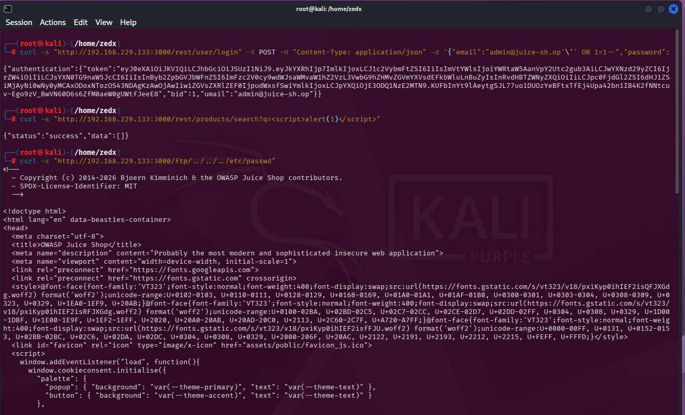
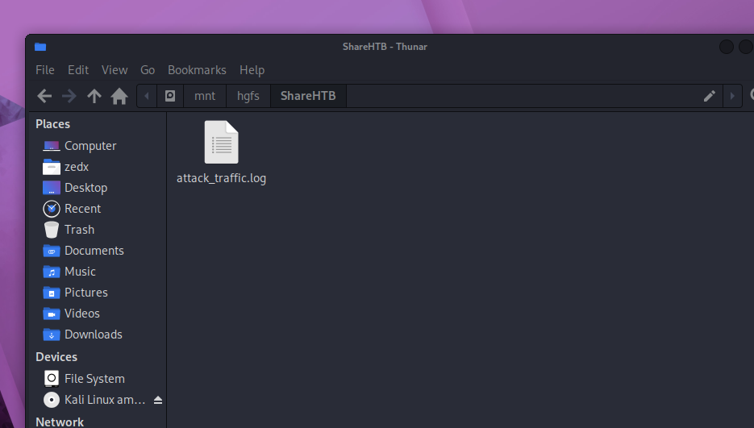
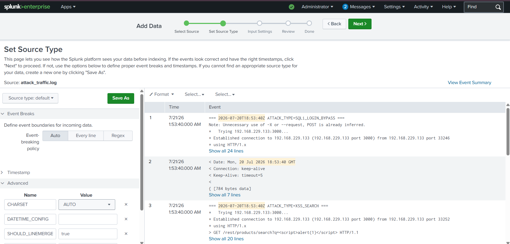
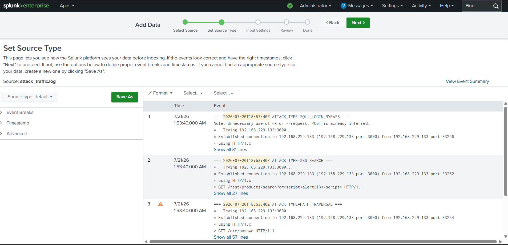
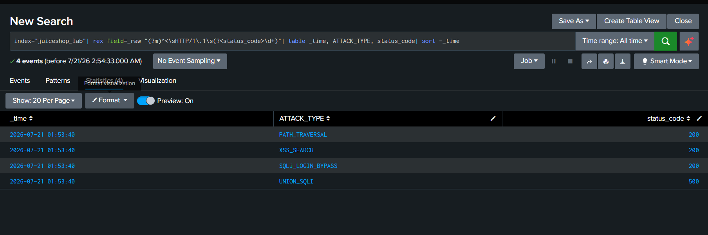
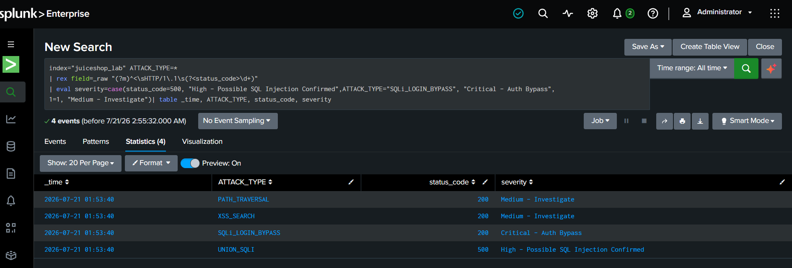
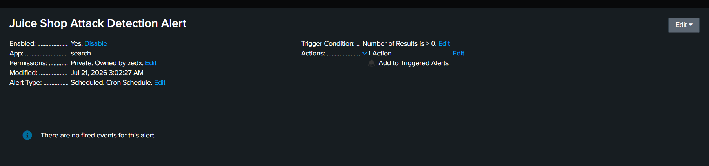
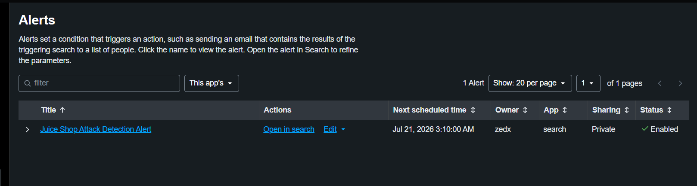
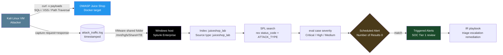

# SOC Splunk Detection Lab — OWASP Juice Shop

> **End-to-end SOC Tier 1 workflow, reproduced in a home lab.**
> Solves the "I know SOC theory but have nothing to show" problem: generates real attack traffic against a vulnerable web app, ingests it into Splunk, writes SPL detection + severity triage, fires a scheduled alert, and follows through with a written IR playbook — every step evidenced by a screenshot.


---

## Screenshots

| Attack execution | Log transfer to SIEM |
|---|---|
|  |  |

| Splunk event breaking | Splunk event preview (4 events parsed) |
|---|---|
|  |  |

| SPL: ATTACK_TYPE + status_code | SPL: severity classification |
|---|---|
|  |  |

| Alert configuration | Active alerts list |
|---|---|
|  |  |

---

## Key Skills Demonstrated

- **Attack simulation** — sent 4 distinct web attack payloads (SQLi login bypass, UNION-based SQLi, reflected XSS, path traversal) from Kali with `curl -v`, capturing full request/response with timestamps into `attack_traffic.log`.
- **Log ingestion & source-typing in Splunk** — created dedicated index (`juiceshop_lab`), custom source type, verified correct event breaking (4 events parsed as separate records, not one blob).
- **SPL detection engineering** — wrote SPL queries using `rex` field extraction for HTTP status code, `eval case()` for severity classification, and `table` for triage-ready output. Full queries in [`spl-queries.md`](spl-queries.md).
- **Severity triage logic** — automated Critical / High / Medium tagging based on attack type + server response, mirroring Tier 1 workflow instead of treating every hit equally.
- **Alert configuration** — saved the detection search as a scheduled Splunk Alert (`Number of Results > 0`, cron-scheduled, Add to Triggered Alerts).
- **True-positive vs false-positive discipline** — path traversal payload was investigated and **documented as a false positive** (Express served its own static file, not `/etc/passwd`) rather than inflated into a "critical" finding. Shows real triage judgement.
- **Incident Response playbook writing** — full Detection → Triage → Escalation → Remediation → Lessons Learned flow in [`ir-playbook.md`](ir-playbook.md), with per-finding escalation reasoning and concrete remediation recommendations (parameterized queries, output encoding, CSP, error-message suppression).

---

## Architecture / Workflow


```mermaid
flowchart LR
    A[Kali Linux VM<br/>Attacker] -->|curl -v payloads<br/>SQLi / XSS / Path Traversal| B[OWASP Juice Shop<br/>Docker target]
    A -->|capture request+response| C[(attack_traffic.log<br/>timestamped)]
    C -->|VMware shared folder<br/>/mnt/hgfs/ShareHTB| D[Windows host<br/>Splunk Enterprise]
    D --> E[Index: juiceshop_lab<br/>Source type: juiceshop_lab]
    E --> F[SPL search<br/>rex status_code + ATTACK_TYPE]
    F --> G[eval case severity<br/>Critical / High / Medium]
    G --> H{Scheduled Alert<br/>Number of Results 0}
    H -->|match| I[Triggered Alerts<br/>SOC Tier 1 review]
    I --> J[IR playbook<br/>triage escalation remediation]

    style A fill:#557C94,color:#fff
    style B fill:#2496ED,color:#fff
    style D fill:#000,color:#fff
    style H fill:#4a3a1a,color:#fff
    style I fill:#1a4a2a,color:#fff
```

---

## Attack Traffic Summary

| Attack Type | Payload | Status | Finding |
|---|---|---:|---|
| **SQLi Login Bypass** | `' OR 1=1--` in login email | 200 | **Critical** — returned valid admin JWT (auth bypass confirmed) |
| **UNION SQLi** | `' UNION SELECT 1,2,3--` in search | **500** | **High** — `SQLITE_ERROR: near "UNION"` confirms unsanitized input + discloses DB backend |
| **Reflected XSS** | `<script>alert(1)</script>` in search | 200 | **Medium** — payload accepted; needs browser-based DOM verification |
| **Path Traversal** | `../../../etc/passwd` | 200 | **False positive** — Express served its own static file, no OS-level escape |

---

## Core SPL — Severity Classification

```spl
index="juiceshop_lab" ATTACK_TYPE=*
| rex field=_raw "(?m)^<\sHTTP/1\.1\s(?<status_code>\d+)"
| eval severity=case(
    status_code=500, "High - Possible SQL Injection Confirmed",
    ATTACK_TYPE="SQLi_LOGIN_BYPASS", "Critical - Auth Bypass",
    1=1, "Medium - Investigate"
  )
| table _time, ATTACK_TYPE, status_code, severity
```

Result:

| Time | Attack Type | Status | Severity |
|---|---|---:|---|
| 2026-07-21 01:53:40 | SQLi_LOGIN_BYPASS | 200 | Critical - Auth Bypass |
| 2026-07-21 01:53:40 | UNION_SQLI | 500 | High - Possible SQL Injection Confirmed |
| 2026-07-21 01:53:40 | XSS_SEARCH | 200 | Medium - Investigate |
| 2026-07-21 01:53:40 | PATH_TRAVERSAL | 200 | Medium - Investigate |

Full query set: [`spl-queries.md`](spl-queries.md).

---

## Tech Stack

| Layer | Choice |
|---|---|
| Attacker VM | Kali Linux |
| Vulnerable target | OWASP Juice Shop (Docker) |
| Traffic generator | `curl -v` |
| Log transport | VMware shared folder |
| SIEM | Splunk Enterprise (Free/Trial) |
| Detection language | SPL (`rex`, `eval case()`, `table`) |
| Alerting | Splunk scheduled alert (cron) |

---

## How to Reproduce the Lab

1. **Spin up target** — Docker: `docker run -d -p 3000:3000 bkimminich/juice-shop`
2. **Spin up attacker** — Kali VM on the same host network
3. **Generate traffic** — send the 4 payloads from the "Attack Traffic Summary" table above with `curl -v`, redirect all output (headers + body + timestamps) into `attack_traffic.log`, prefixing each block with an `ATTACK_TYPE=...` marker so Splunk auto-extracts it
4. **Transfer log** — copy `attack_traffic.log` to the Splunk host (VMware shared folder used here; SCP/rsync works too)
5. **Ingest into Splunk** — Settings → Add Data → Upload → set source type = `juiceshop_lab`, index = `juiceshop_lab`, verify event breaking (should be 4 events)
6. **Run detection** — paste the severity-classification SPL from above into Search
7. **Save as alert** — Save As → Alert → Scheduled (cron), Trigger: Number of Results > 0, Action: Add to Triggered Alerts

---

## Repo Contents

```
soc-splunk-detection-lab/
├── README.md              # this file
├── spl-queries.md         # every SPL search used, with results
├── ir-playbook.md         # Detection → Triage → Escalation → Remediation → Lessons Learned
└── screenshots/           # 8 evidence screenshots (Kali → Splunk → alert)
```

---

## Lessons Learned

- Application debug logs (`docker logs`) are insufficient for detection — they lack full request payload / query string detail. Capturing at the point of origin (`curl -v`) produced far more usable evidence.
- Not every "attack" is exploitable. Documenting the path-traversal false positive is as valuable as the two confirmed criticals — over-alerting erodes trust in a detection pipeline.
- **Next steps:** put an Nginx reverse proxy in front of Juice Shop for realistic HTTP access logs; map fields to Splunk's Common Information Model (CIM); integrate a ticketing system to simulate the Tier 1 → Tier 2 handoff.

---

## Disclaimer

**For educational use in an isolated lab environment only.** All testing was performed against a local, intentionally vulnerable application (OWASP Juice Shop) running in Docker, on a private VMware host network. No external, third-party, or production systems were targeted. Do not point these techniques at any system you do not own or do not have written authorization to test.
